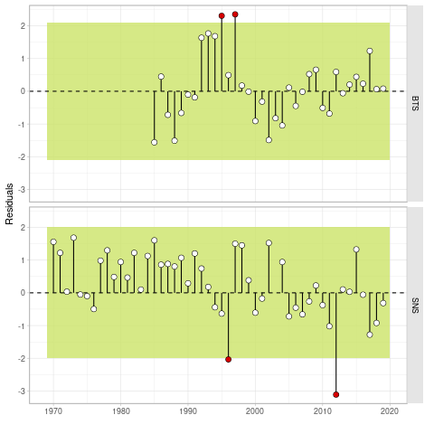

# a4adiags: Diagnostics for FLa4a stock Assessment Models

Additional Diagnostics for FLa4a stock Assessment Models

## Installation

Install the development version from GitHub with:

    devtools::install_github("flr/a4adiags")

This package depends on [FLa4a](https://flr-project.org/FLa4a), [FLasher](https://flr-project.org/FLasher) and [ggplotFL](https://flr-project.org/ggplotFL), available at the [FLR Project repository](https://flr-project.org/R) using

    install.packages(c("FLa4a", "FLasher", "ggplotFL"), repos="https://flr-project.org/R")

and *ggplot2*, *snpar*, *foreach* and *data.table*, available from CRAN

    install.packages(c("ggplot2", "snpar", "foreach", "data.table"))

To make use of the parallelization capabilities in the package, install *doParallel* or any other *foreach* backend.

## Features

## Cross-validation with restrospective hindcasting

<!-- -->

### Runs tests

<!-- -->

## Documentation

- [Help pages](http://flr-project.org/a4adiags)

## License

Copyright (c) 2020 European Union. Released under the [EUPL 1.2](https://joinup.ec.europa.eu/collection/eupl/eupl-text-eupl-12).

## Authors

Iago MOSQUEIRA (WMR), Henning WINKER (EC JRC).

## Contact

You are welcome to:

- Submit suggestions and bug-reports at: <https://github.com/flr/a4adiags/issues>
- Send a pull request on: <https://github.com/flr/a4adiags/>
